# Top 27 Cashback and Rewards Apps in 2025 (Continuously Updated)

Watching your budget shouldn't mean missing out on travel or everyday purchases. The right cashback and rewards app turns routine spending into tangible savings, whether you're booking hotels, filling up gas, or buying groceries. This curated list walks through 27 platforms that put money back in your pocket, ranked by overall value and real-world usability, helping you stack rewards without juggling complicated point systems or scanning endless receipts.

***

## **[Super.com](https://www.super.com)**

All-in-one financial app combining travel deals, cashback rewards, and earning opportunities for comprehensive money management.

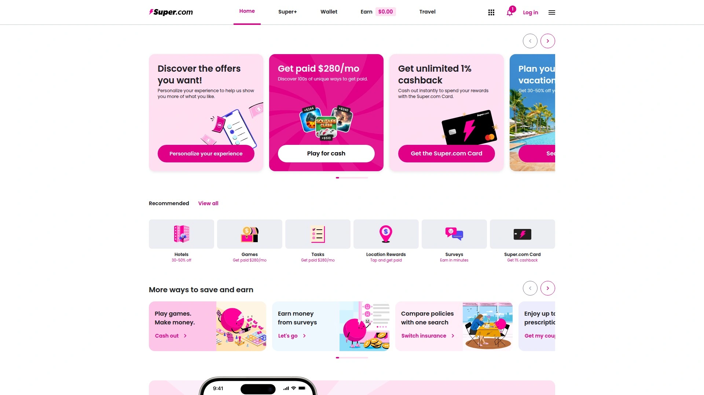

Super.com stands out by merging multiple money-saving features into one platform. You get hotel bookings with discounts reaching 50% off standard rates, making travel affordable without sacrificing quality. The app lets you earn extra cash through mobile games, surveys, and completing simple tasks, with payouts depositing directly to your Super Card. Cashback opportunities cover online purchases plus discounts on gas, insurance, and prescriptions through the mobile app. The Super+ membership adds cash advances up to $250, 10% cashback on hotel bookings, unlimited 1% cashback with the Super Card, and credit building tools that help establish financial history. Since launching as SnapTravel in 2016 and rebranding in 2022, the company has processed over $2 billion in sales. Financial Times ranked it as the 11th fastest growing company in North America. The platform's strength lies in consolidating travel, earning, and financial services rather than forcing you to juggle separate apps. Users report earning $200-$300 within weeks through game completion and task activities. Text and email updates keep you informed throughout hotel bookings, and 24/7 customer support handles reservation questions almost immediately.

---

## **[Rakuten](https://www.rakuten.com)**

Veteran cashback platform offering automatic rewards on online purchases with browser extension convenience.

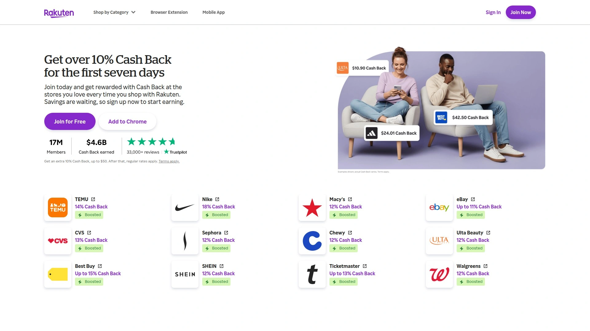

Operating since 1998 as Ebates before rebranding, Rakuten partners with over 3,500 stores including Macy's, Best Buy, and StubHub. Cashback rates vary by retailer, with some offering over 10% returns on purchases. The browser extension automatically applies coupon codes and tracks cashback when you shop online. Link a credit card to earn rewards on in-store purchases at select locations, though you must run debit cards as credit for in-store earnings. Payouts arrive quarterly via PayPal, check, or American Express points, with a $5.01 minimum for mailed checks. New users receive $10-$30 bonuses after their first qualifying purchase. The platform excels at stacking deals by combining manufacturer coupons with cashback, maximizing savings on large purchases. Shopping must start through Rakuten's app, website, or extension for proper tracking. The interface remains straightforward, displaying available cashback percentages before you click through to retailers. Earnings appear as pending until stores confirm purchases, with timing varying by merchant policies. App Store ratings hit 4.8 stars while Google Play shows 3.4, reflecting strong iOS user satisfaction. The quarterly payout schedule means waiting longer for your money compared to instant withdrawal apps.

***

## **[Ibotta](https://home.ibotta.com)**

Grocery-focused cashback app with AI-driven personalization and expanding coverage beyond supermarkets.

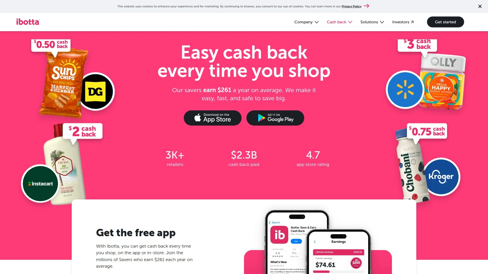

Ibotta went public in April 2024, securing partnerships with Walmart, Kroger, and Shell while introducing AI-powered offer personalization that learns your shopping habits. The app covers 500+ exclusive offers across groceries, gas, restaurants, and digital gift cards. Link loyalty cards from specific retailers or upload receipts to earn cashback on selected products, with "Any Item" offers providing rebates on staples like eggs and milk. The Nearby Offer Alerts feature notifies you when approaching participating retailers. Average users earn $150+ annually by incorporating Ibotta into regular shopping routines. Browser extension integration automatically applies offers when shopping online through partner retailers. The app provides immediate cash rather than points-based systems, though the $20 minimum withdrawal threshold takes time for casual users to reach. Team bonuses and seasonal challenges add gamification elements encouraging consistent use. Some offers require purchasing specific brands you might not normally choose, nudging buying behavior toward promoted products. Receipt rejection occasionally frustrates users expecting approved cashback from grocery runs. App Store and Google Play ratings both exceed 4.6 stars, reflecting solid user satisfaction across platforms.

***

## **[Fetch Rewards](https://fetch.com)**

Receipt-scanning app with game integration rewarding you for everyday purchases without brand restrictions.

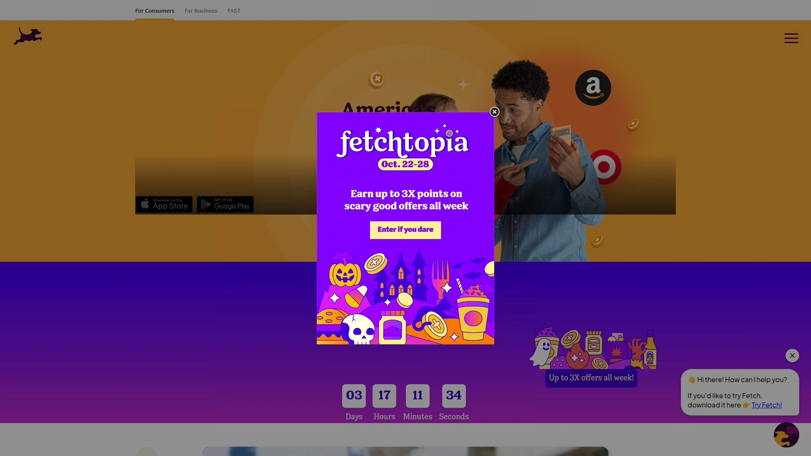

Fetch has distributed over $1 billion in rewards since launch, letting users snap receipts from any store to earn points. You collect 25 points per receipt baseline, with bonus points when purchasing partnered brands featured in personalized offers. The app's machine learning technology scans receipts quickly, recognizing products and calculating points automatically. Beyond receipt scanning, play mobile games and shop online through Fetch to accelerate point accumulation. Redemption options include gift cards to major retailers with no confusing conversion rates. The interface emphasizes speed and simplicity, making receipt capture nearly effortless. You don't need credit cards or specific store loyalty programs, just your purchase receipts. Email receipts qualify alongside physical ones. Boosted brand promotions rotate regularly, highlighting products offering extra points during limited windows. Points never expire as long as you scan at least one receipt every 90 days. Reaching 10,000 points happens faster than expected when combining receipt scanning with promotional offers and game participation. The app serves casual users who want passive earning without hunting specific deals before shopping. Frequent receipt scanners appreciate how quickly small point totals compound into meaningful gift card redemptions.

***

## **[Hopper](https://hopper.com)**

Price prediction travel app helping 100+ million users find optimal booking times for flights and hotels.

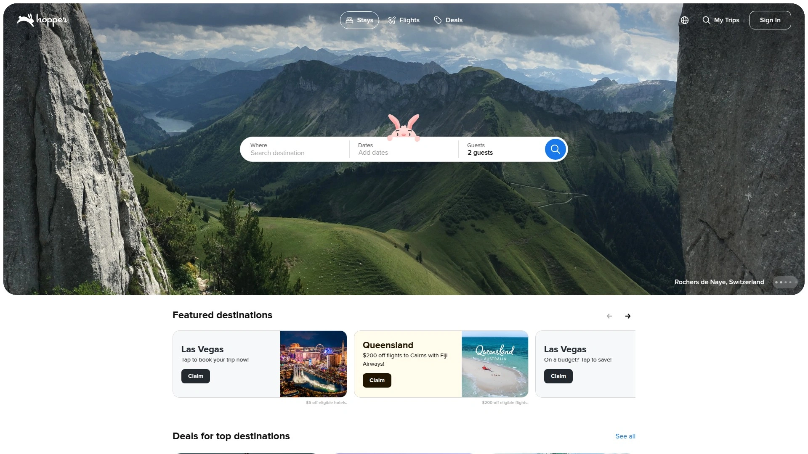

Hopper's algorithm claims 95% accuracy predicting flight and hotel prices up to a year in advance. The color-coded calendar instantly shows cheapest travel dates for your destination. Watch trips inside the app and receive notifications recommending when to book now versus waiting for price drops. Price freeze features let you lock rates for a small fee, protecting against increases while still benefiting if prices fall. The app covers flights, hotels, vacation homes, and rental cars from 2+ million accommodation options globally. Carrot Cash rewards provide up to 5% back on bookings, usable toward future travel. Cancel and Change for Any Reason plans add flexibility avoiding typical change fees. Flight Disruption Guarantee instantly rebooks you without extra costs when facing delays or missed connections. The platform targets Millennials and Gen Z, remaining app-only without desktop expansion. Over 75 million users have booked through Hopper since 2014 founding by ex-Expedia executives. Hotel inventory comes from OTAs like Booking Holdings and SiteMinder rather than direct hotel relationships, positioning Hopper as metasearch technology. The simplified interface makes travel planning accessible in just taps and swipes. 24/7 customer support provides assistance throughout booking processes and travel disruptions.

***

## **[Upside](https://www.upside.com)**

Gas-focused cashback app offering up to 25¢ per gallon plus rewards on groceries and dining.

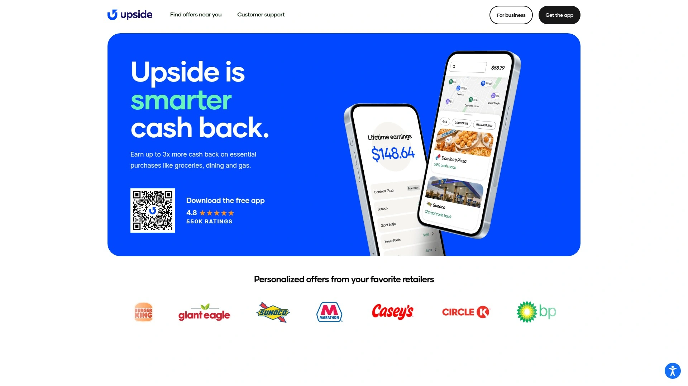

Upside partners with over 100,000 gas stations, grocery stores, and restaurants across America. Users earn an average 8% cashback on groceries and dining, stacking on top of existing credit card rewards. Gas cashback reaches 25¢ per gallon, grocery returns hit 30%, and restaurant offers climb to 45% at participating locations. Partners include Phillips 66, Shell, Chevron, Exxon, Applebee's, Domino's, Giant Eagle, and hundreds more. The process involves claiming offers through the app, paying normally with any credit or debit card, then following instructions to confirm purchases. Frequent users average $290 annually just by adding Upside to normal routines. Cashout options include direct bank deposits or e-gift cards to Amazon, Home Depot, and Walmart. The app doesn't sell personal location data despite requesting access to show nearby offers. Transparent cashback amounts display before claiming offers, eliminating surprise reward values. Offers remain active several hours after claiming, giving flexibility for shopping timing. No confusing points systems or conversion calculations, just straightforward dollar amounts. The gas savings particularly appeal to commuters and road trippers watching fuel budgets. Combining Upside with credit card rewards creates layered savings exceeding single-program limitations.

***

## **[Shopkick](https://www.shopkick.com)**

Unique rewards app paying you for walking into stores without requiring purchases.

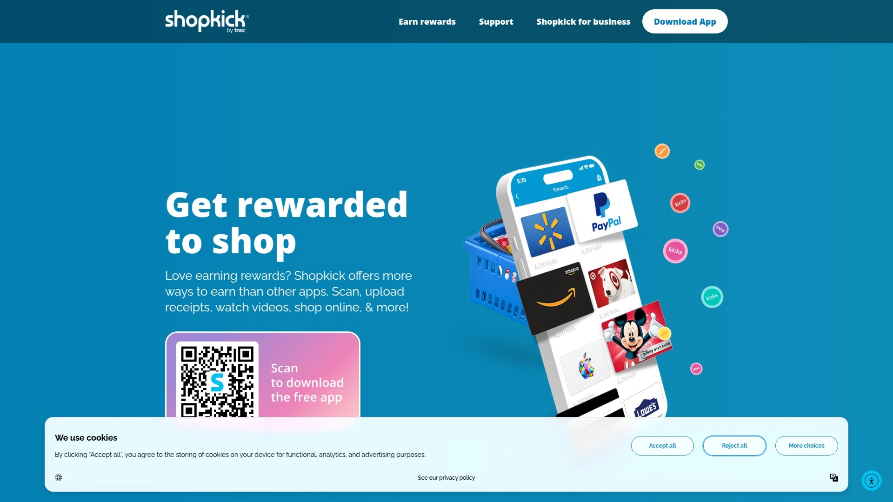

Shopkick differs fundamentally by rewarding store visits, barcode scans, and product interactions alongside actual purchases. Earn "kicks" simply by walking into participating retailers, creating scavenger-hunt experiences while shopping. Scanning product barcodes adds points without buying anything, making it possible to accumulate rewards without spending money. Upload receipts or link cards for purchase-based rewards when you do buy items. The gamification approach feels more engaging than passive cashback tracking. Over 10 million users participate without needing credit cards to start earning. Partner retailers span major brands where you already shop. Redeem kicks for gift cards or PayPal deposits once balances reach minimum thresholds. Earning rates remain low without purchases, so serious rewards require combining multiple earning methods. The app easily slips from mind if you forget checking it before store visits. App Store ratings hit 4.6 stars with Google Play showing 3.7, indicating stronger iOS user satisfaction. The platform suits people enjoying in-person shopping who want rewards beyond purchase-based programs. Combining walk-in points with scan activities and occasional purchases generates meaningful rewards over time without major behavior changes.

***

## **[HotelTonight](https://www.hoteltonight.com)**

Last-minute hotel booking specialist offering discounted rooms with immediate availability.

HotelTonight focuses on same-day and short-notice hotel reservations at reduced rates. Hotels list unsold inventory at discounts rather than leaving rooms empty. The mobile-first interface streamlines booking processes to just minutes. You can book up to 100 days in advance despite the "tonight" branding. Partner hotels span from budget options to luxury properties in major cities worldwide. The app suits spontaneous travelers, business professionals needing quick accommodation, and anyone chasing good deals on short notice. Loyalty program rewards frequent bookers with additional savings and perks. Booking confirmation arrives immediately with all necessary reservation details. Customer reviews and ratings help assess properties before committing. The platform's reputation for quality vetted hotels reduces risk compared to deep-discount aggregators. Mobile notifications alert you to flash sales and exclusive offers. The simple interface removes booking friction that delays decisions on traditional travel sites. While not offering cashback mechanisms like some competitors, the upfront discounts provide immediate value. HotelTonight excels for specific last-minute booking scenarios rather than planned travel months ahead.

***

## **[Drop](https://www.earnwithdrop.com)**

Automatic rewards app linking cards to track spending and earn points without receipt scanning.

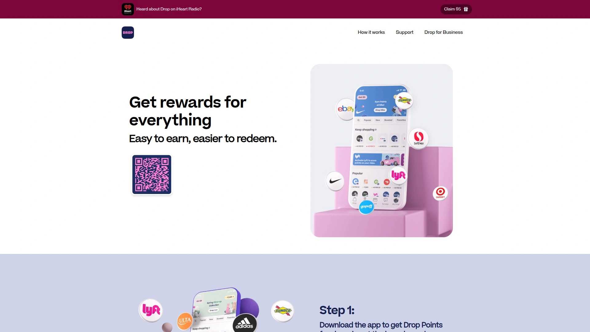

Drop connects to your debit and credit cards, automatically tracking purchases at partner merchants. The passive earning model eliminates manual receipt uploads or offer activations. Partner brands span groceries, restaurants, rideshares, and retail covering everyday spending categories. Points accumulate based on spending at linked merchants, with rates varying by retailer. The app highlights personalized offers based on your spending patterns and preferences. Redeem points for gift cards to Amazon, Starbucks, Netflix, and numerous other brands. Minimum redemption thresholds remain low, letting you cash out rewards faster than high-minimum competitors. Privacy protections include bank-level encryption and no selling of personal data. The automatic nature means you never miss earning opportunities by forgetting to activate offers. Interface design emphasizes simplicity with clear point balances and redemption options. Some users report lower earning rates compared to receipt-scanning alternatives, but convenience compensates. The app suits people wanting passive rewards without active participation in cashback hunting. Link multiple cards to maximize earning coverage across all your spending.

***

## **[Swagbucks](https://www.swagbucks.com)**

Multi-activity rewards platform combining surveys, shopping, videos, and games for earnings.

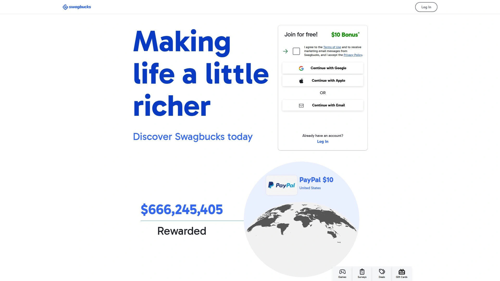

Swagbucks has paid out over $750 million to members since 2008. Earn "Swagbucks" (SB) through online shopping, completing surveys, watching videos, playing games, and searching the web. Partner retailers include Amazon, Walmart, and thousands of others offering cashback when shopping through Swagbucks. Daily polls, printable coupons, and special offers provide additional earning avenues. Cash out via PayPal or choose gift cards to major retailers once reaching minimum thresholds. New member bonuses give you a head start on earnings. The browser extension automatically alerts you to cashback opportunities while browsing. Survey availability varies based on demographics and current research needs. Video watching provides passive earning while multitasking, though payouts remain modest per video. The web search engine powered by Yahoo lets you earn SB for regular searches. Mobile app covers most features for earning on the go. The variety of earning methods means finding activities matching your preferences and time availability. Power users combining multiple earning strategies accumulate rewards faster. Casual participants still benefit from shopping cashback and occasional surveys without major time investments.

***

## **[Honey](https://www.joinhoney.com)**

Browser extension automatically applying coupon codes and tracking price drops for online shopping savings.

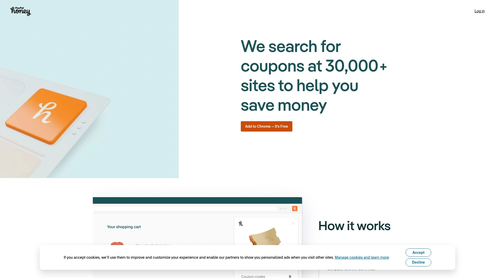

PayPal acquired Honey for $4 billion, validating its value proposition to shoppers. The extension tests available coupon codes at checkout, automatically applying the best savings. You don't need to search coupon websites or hunt discount codes manually. Honey Gold rewards accumulate on purchases at participating retailers, redeemable for gift cards. Price tracking alerts you when watched items drop below target prices. The Droplist feature monitors products across retailers, notifying you of the best current price. Amazon integration shows price history graphs revealing optimal buying times. Over 30,000 partner sites include major online retailers covering most shopping categories. Installation takes seconds, working silently in the background until you reach checkout pages. The extension respects privacy, using data only for coupon application and rewards. Savings vary by retailer and season, with some purchases offering no available codes. The automatic approach eliminates the frustration of finding expired or invalid coupon codes. Mobile app extends functionality beyond desktop browsing. Honey excels at effortless savings for online shoppers already purchasing from partner retailers. The browser integration means zero behavior changes required to start saving.

***

## **[Seated](https://www.seated.com)**

Restaurant reservation app offering rewards just for dining at partner restaurants.

Seated pays you for making and honoring reservations at participating restaurants. You earn rewards simply by showing up and ordering, with no minimum spending requirements. Partner restaurants span major cities, covering various cuisines and price points. Redemption options include gift cards to Amazon, Uber, and other popular services. The app helps discover new dining spots while earning rewards automatically. Reservation process takes just moments, integrating with restaurant booking systems. You must complete the reservation and make qualifying purchases to receive rewards. Earning amounts vary by restaurant, time, and day, with less popular time slots often offering higher rewards. The platform suits urban residents with diverse restaurant options nearby. Tracking happens automatically once you book through Seated, eliminating post-meal confirmation steps in most cases. Some restaurants require credit card holds on reservations to prevent no-shows. The rewards effectively discount dining costs without using traditional coupons or deals. Exploring new restaurants becomes more appealing when earning rewards for trying new places. Group reservations earn rewards while enjoying social dining experiences. The app works particularly well for frequent diners wanting passive earnings from existing habits.

***

## **[Booking.com](https://www.booking.com)**

Global accommodation leader offering extensive inventory with Genius loyalty rewards program.

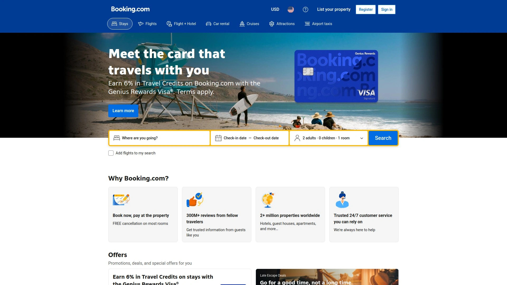

Booking.com lists millions of properties spanning hotels, apartments, hostels, and vacation rentals worldwide. The Genius loyalty program provides exclusive discounts and perks at participating properties after completing qualifying stays. Free cancellation on most bookings adds flexibility for uncertain travel plans. Verified reviews from actual guests help assess properties accurately before booking. The platform covers accommodations at all price points from budget to luxury. Mobile app enables booking and management on the go with instant confirmation. Customer service operates 24/7 in multiple languages supporting international travelers. Deals and promotions regularly feature specific destinations or property types. The extensive inventory means finding availability even during peak travel periods. Search filters narrow results by price, amenities, location, and guest ratings. Booking.com Wallet and stored payment methods streamline repeat bookings. The platform suits independent travelers booking accommodation separately from packages. Price competitiveness varies by destination and season, sometimes matching or beating competitors. The Genius program rewards loyalty with increasingly better discounts as you complete more bookings. Map views help visualize property locations relative to attractions and transportation.

***

## **[Airbnb](https://www.airbnb.com)**

Peer-to-peer accommodation marketplace connecting travelers with unique stays and experiences.

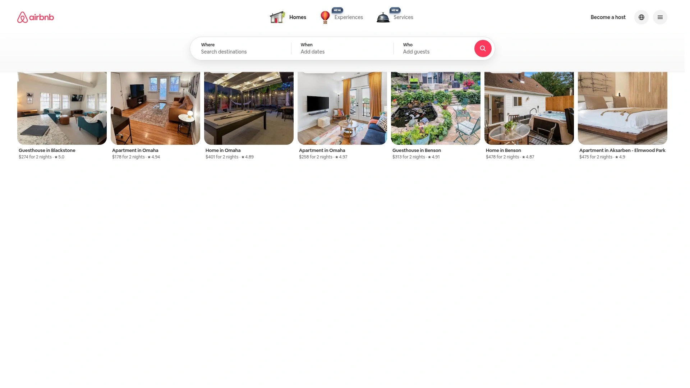

Airbnb revolutionized travel accommodation by enabling individuals to rent homes, apartments, and unique properties. Listings span from single rooms to entire estates in over 220 countries and regions. Experiences feature local hosts offering activities, tours, and classes beyond simple accommodation. The platform emphasizes authentic local living rather than standardized hotel experiences. Guest reviews and host ratings create accountability encouraging quality and honesty. Superhost designation identifies exceptional hosts meeting high standards. Instant Book properties confirm reservations immediately without host approval wait times. Airbnb insurance and support systems protect both guests and hosts during stays. Pricing often competes favorably with hotels, especially for groups or longer stays. Unique properties include treehouses, castles, boats, and architectural masterpieces unavailable through traditional booking. Search filters accommodate specific needs like pet-friendly, accessible properties, or work-friendly amenities. The messaging system facilitates direct guest-host communication before and during stays. Flexible cancellation policies vary by host, with some offering full refunds up to check-in. The platform transformed travel by creating earning opportunities for property owners and affordable options for travelers.

***

## **[Expedia](https://www.expedia.com)**

Full-service travel booking platform bundling flights, hotels, cars, and activities with package discounts.

Expedia operates as one of the largest online travel agencies, offering comprehensive travel planning tools. Bundle flights, hotels, and car rentals to unlock package discounts exceeding separate bookings. Expedia Rewards program provides points on bookings, redeemable toward future travel with no blackout dates. The platform aggregates inventory from airlines, hotels, and car rental companies into searchable databases. Price tracking alerts notify you when watched trips change in cost. Mobile app features itinerary management, mobile check-in, and travel assistant tools. Expedia's scale enables negotiated rates and exclusive deals unavailable booking directly. Last-minute hotel deals fill unsold inventory at discounted prices. Activities and tours bookable through the platform simplify complete trip planning. Customer service handles booking issues, changes, and cancellations through various channels. Package pricing transparency shows savings compared to booking components separately. The breadth of options accommodates all traveler types from budget to luxury. Virtual agent assistance and live chat provide immediate booking support. Expedia Group brands include Hotels.com, Vrbo, and Orbitz, consolidating market presence. The platform suits travelers preferring one-stop shopping over managing multiple booking sites.

***

## **[Agoda](https://www.agoda.com)**

Asia-focused travel platform with strong regional coverage and competitive pricing.

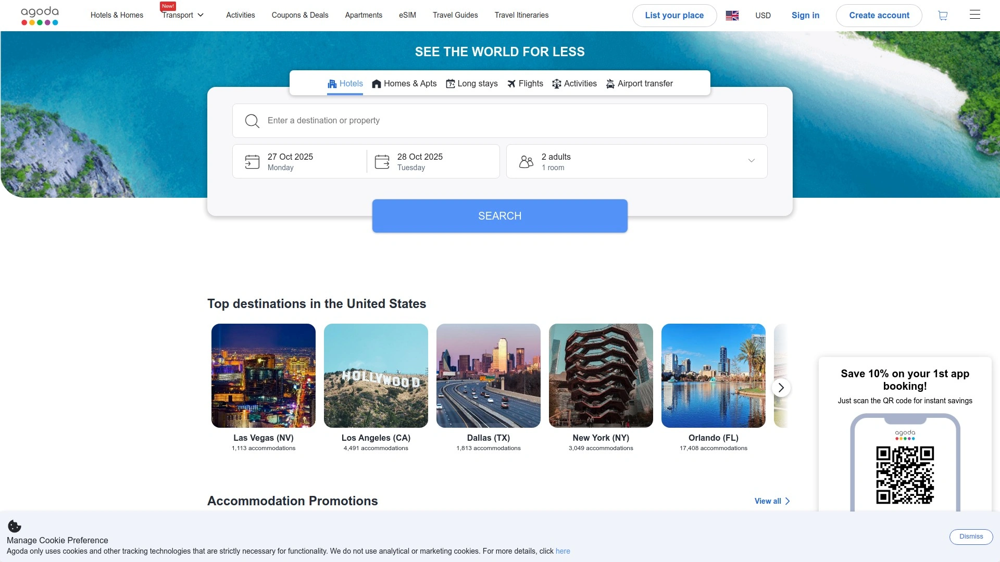

Agoda specializes in Asian accommodation while covering worldwide destinations. The platform lists over 2 million properties including hotels, homes, and apartments. Prices often beat competitors for Asian destinations thanks to regional partnerships and inventory. PointsMAX feature lets you earn airline miles or hotel points simultaneously with Agoda bookings. Insider deals provide exclusive pricing for registered users and email subscribers. The Secret Deals feature reveals discounted properties after booking rather than during search. Flexible cancellation policies on select properties accommodate changing travel plans. Customer reviews include detailed ratings across multiple property aspects. Currency conversion displays prices in your preferred currency for budget planning. The platform targets price-conscious travelers seeking value over luxury branding. Flash sales feature limited-time discounts on popular destinations. Mobile app functionality mirrors desktop features with push notifications for deal alerts. Agoda Homes competes with vacation rental platforms offering entire property stays. The interface emphasizes deal discovery and price comparison across dates. Loyalty benefits increase with booking frequency through membership tiers. The platform excels for Southeast Asian travel where regional expertise provides advantages.

***

## **[Priceline](https://www.priceline.com)**

Discount travel site known for Express Deals and Name Your Own Price features.

Priceline pioneered opaque booking with Name Your Own Price hotel bidding, though the feature has evolved. Express Deals hide exact hotel names until after booking in exchange for steep discounts. The platform aggregates flights, hotels, rental cars, and cruises with price comparison tools. VIP rewards program provides exclusive discounts and credit toward future bookings. Package deals bundle travel components for additional savings beyond individual bookings. Rental car Express Deals regularly beat standard rates from rental companies directly. The mobile app includes exclusive mobile-only deals unavailable on desktop. Pricebreakers bundles vacation packages to popular destinations at all-inclusive prices. Tonight-only hotel deals fill last-minute inventory at major discounts. The Best Price Guarantee promises to match lower prices found elsewhere. Bank credit card partnerships offer additional statement credits on Priceline bookings. The platform suits flexible travelers willing to accept some uncertainty for significant savings. Express Deals work best when location matters more than specific property identity. Customer service handles booking modifications and issues through multiple contact channels. Priceline's scale enables negotiated rates across major travel suppliers creating competitive pricing.

***

## **[Hotels.com](https://www.hotels.com)**

Hotel-focused booking platform with straightforward rewards program offering free nights.

Hotels.com specializes in accommodation bookings with a simple rewards structure. Earn one reward night after booking ten nights through the platform. The rewards program requires no complex points calculations or tier systems. Listings cover major hotel chains and independent properties globally. Secret Prices membership unlocks instant discounts on select properties. Mobile app features Price Drop Protection refunding differences if prices fall after booking. Virtual tours and detailed photos help assess properties before committing. Neighborhood guides provide context about areas surrounding hotels. Customer reviews filter by traveler type including families, couples, and business travelers. 24/7 customer service assists with bookings in multiple languages. Best Price Guarantee promises to match lower prices found within 24 hours of booking. The platform's simplicity appeals to travelers wanting straightforward booking without overwhelming choices. Filters narrow searches by price, location, amenities, and guest ratings. Email alerts notify you of price drops on watched properties. Hotels.com Rewards integrates across the Expedia family of brands. The free night reward provides tangible value for frequent travelers accumulating stays quickly.

***

## **[Trivago](https://www.trivago.com)**

Hotel price comparison metasearch engine aggregating rates from hundreds of booking sites.

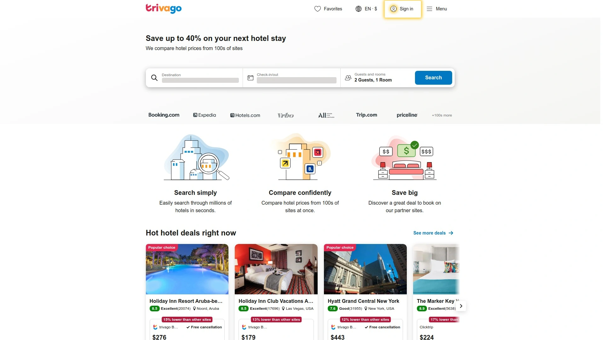

Trivago compares hotel prices across 200+ booking sites including Expedia, Booking.com, and hotel direct sites. The platform doesn't handle bookings directly, instead redirecting you to selected booking sites. Room type comparison shows pricing across different dates and configurations. The interface emphasizes visual search with map integration and photo prominence. Filter options include price ranges, guest ratings, amenities, and distance from landmarks. Trivago doesn't add booking fees, showing the same prices available on partner sites. The platform suits price-conscious travelers wanting comprehensive comparison before booking. Rate comparison includes taxes and fees for accurate total cost visibility. Saved searches and price alerts notify you when rates change on watched hotels. Mobile app mirrors desktop functionality for comparison shopping on the go. User reviews aggregate from multiple sources providing broader perspective than single-site reviews. The metasearch approach sometimes surfaces better deals than searching individual sites. Hotel quality indicators highlight properties meeting specific standards. Trivago's German parent company operates with European consumer protection standards. The platform works best early in travel planning when flexibility allows optimal pricing.

***

## **[Kayak](https://www.kayak.com)**

Travel search engine comparing flights, hotels, and car rentals across hundreds of sites.

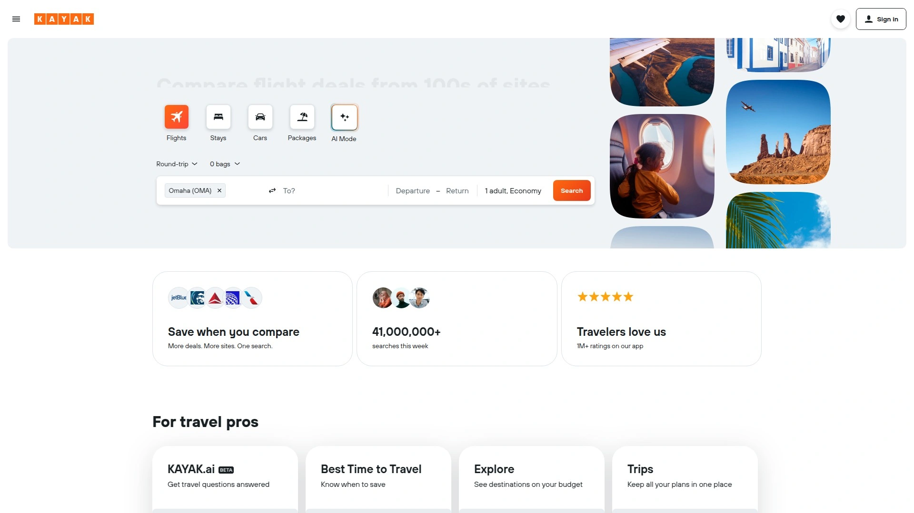

Kayak aggregates pricing from airlines, hotels, online agencies, and rental companies into unified search results. Price forecasting predicts whether prices will rise or fall, advising booking timing. Explore tool generates destination ideas based on your budget and travel dates. Price alerts notify you immediately when monitored trips change in cost. The platform searches hundreds of sites simultaneously, saving hours of manual comparison. Flexible date searches show pricing across multiple departure and return dates. Booking happens through partner sites after comparing options on Kayak. The mobile app includes trip itinerary management organizing confirmations in one place. Hacker Fares combine one-way flights on different airlines creating cheaper round-trips. Car rental comparison includes both major companies and local providers. Hotel comparison shows pricing across online agencies and direct hotel bookings. Filter options accommodate specific preferences including airlines, layovers, departure times, and amenities. The free service generates revenue through clicks to booking partners rather than user fees. Price prediction accuracy helps optimize booking timing based on statistical analysis. Kayak suits research-focused travelers wanting comprehensive options before committing to bookings.

***

## **[Skiplagged](https://www.skiplagged.com)**

Controversial flight search tool exposing hidden city ticketing opportunities for savvy travelers.

Skiplagged reveals hidden city tickets where booking a connection through your destination costs less than direct flights. The practice exploits airline pricing inconsistencies but violates most carrier terms of service. You must travel carry-on only since checked bags route to the final ticketed destination. Using hidden city tickets risks airline action including frequent flyer account termination. The platform also searches normal routes alongside hidden city opportunities. Hotel and car rental searches aggregate pricing from standard sources. The controversy stems from airlines disliking the exposure of their pricing inefficiencies. Skiplagged founder faced lawsuits from airlines attempting to shut down the service. Courts have generally sided with Skiplagged, affirming price comparison legality. The tool suits budget travelers willing to accept risk for significant savings. You cannot use hidden city tickets for round trips since missing segments cancels remaining reservations. One-way travel makes hidden city ticketing more practical and less risky. The platform emphasizes transparency showing exactly which flights involve hidden city strategies. Use hidden city tickets infrequently to minimize airline scrutiny of your booking patterns.

***

## **[Hotwire](https://www.hotwire.com)**

Opaque booking specialist offering Hot Rate deals hiding details until purchase completion.

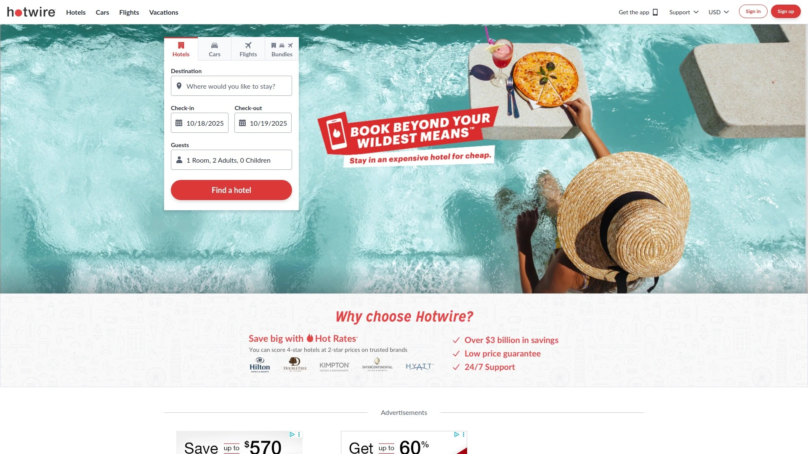

Hotwire provides significant discounts by hiding exact hotel names, flight times, or car rental companies until after booking. Hot Rate hotels reveal only star rating, neighborhood, and amenities before purchase. The opacity allows travel suppliers to discount excess inventory without publicly advertising low prices. Savings typically range 40-60% compared to standard published rates for equivalent properties. The platform suits flexible travelers prioritizing price over property specifics. Standard searchable bookings remain available alongside Hot Rate deals. Car rentals through Hot Rate hide the rental company but guarantee car class and pickup location. Flight Hot Rate deals conceal exact departure times and potential connections while guaranteeing arrival windows. Booking becomes final immediately with limited change or cancellation options. The gamble pays off for travelers comfortable with uncertainty in exchange for savings. Reviews and ratings help assess Hot Rate properties after revealing actual identity. The mobile app includes exclusive mobile-only deals beating desktop pricing. Hotwire Rewards program provides bonus savings for frequent bookings. The platform works best for simple trips where specific property identity matters less than location and price.

***

## **[Capital One Shopping](https://www.capitaloneshopping.com)**

Browser assistant from Capital One comparing prices and applying coupons across online retailers.

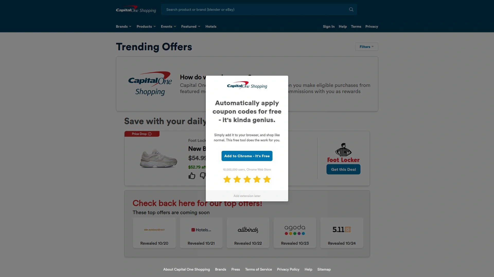

Capital One Shopping operates independently, working for everyone regardless of Capital One customer status. The extension compares prices across retailers while you shop, alerting you to better deals elsewhere. Automatic coupon testing applies available codes at checkout maximizing savings. Reward points accumulate on purchases at partner retailers, redeemable for gift cards. Universal Wishlist tracks products across sites, notifying you of price drops. Amazon integration shows historical pricing and deal quality indicators. The service generates revenue through shopping portals rather than user fees. Installation requires basic permissions for checkout page interaction and price monitoring. Savings vary by retailer and product category, with some purchases offering no available codes or deals. The price comparison happens in real-time as you browse, requiring no manual searching. Recommendations appear as sidebar widgets showing alternative retailers offering better prices. Gift card redemptions cover major brands including Amazon, Target, and Starbucks. The platform suits online shoppers wanting effortless price checking and coupon application. Capital One's brand recognition provides trust and security confidence. The browser extension approach requires no separate app or website visits to access features.

***

## **[RetailMeNot](https://www.retailmenot.com)**

Coupon aggregator providing codes, cashback, and deals for online and in-store shopping.

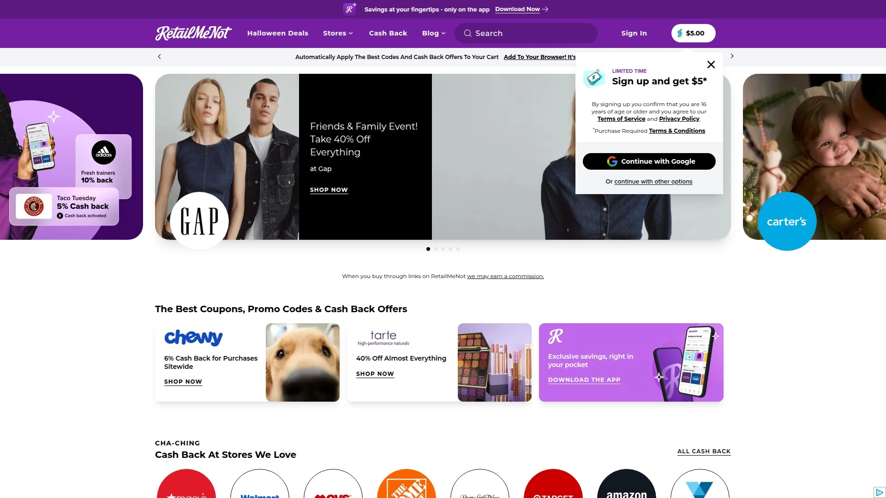

RetailMeNot collects coupon codes from thousands of retailers, maintaining one of the largest code databases. User verification system indicates which codes currently work, reducing frustration from expired offers. Browser extension automatically finds and applies working codes at checkout. Cashback portal provides percentage returns on purchases at participating retailers. In-store coupons display as barcodes scannable directly from your phone. The platform combines manual coupon hunting with automatic browser assistance. Popular retailers featured include Amazon, Walmart, Target, and major fashion brands. Deal pages highlight current sales events and promotional periods across retailers. Seasonal sections organize holiday shopping deals and back-to-school offers. Mobile app brings coupon access and cashback features on the go. Email alerts notify subscribers of new deals matching saved preferences. The community verification approach keeps databases current as promotional terms change. Some codes require minimum purchases or exclude sale items per retailer policies. RetailMeNot Genie provides personalized deal recommendations based on shopping habits. The platform monetizes through merchants paying for featured placement and cashback partnerships. Users benefit from free access to extensive coupon databases and automated savings tools.

***

## **[Getaround](https://www.getaround.com)**

Peer-to-peer car sharing marketplace renting vehicles by the hour from local owners.

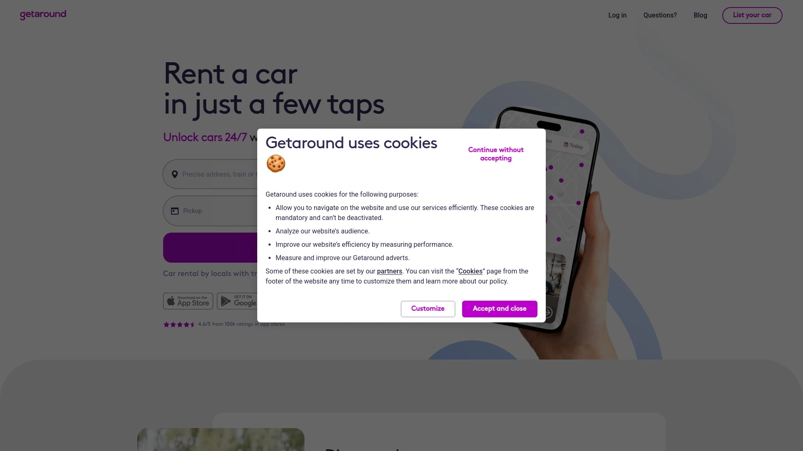

Getaround enables car owners to earn money from vehicles sitting idle while providing affordable rentals. Hourly and daily rental rates typically undercut traditional rental agencies. Keyless technology through the app lets you locate, unlock, and start reserved vehicles remotely. Insurance included through Getaround covers both owners and renters during reservations. Vehicle variety spans economy cars to luxury SUVs depending on owner participation in your area. Instant booking confirms availability without waiting for owner approval. The platform suits urban residents needing occasional car access without ownership costs. Airport locations compete with traditional rental counters at lower prices. Owner vetting and vehicle inspections maintain quality standards across the fleet. Trip protection handles damage claims separating personal liability from rental incidents. Pricing transparency shows hourly and daily rates before booking. Delivery options bring vehicles to your location for additional fees. Fuel costs remain renter responsibility with vehicles provided at specified fuel levels. The sharing economy model creates income for owners while increasing vehicle utilization. Getaround works best in cities with substantial vehicle inventory and user base.

***

## **[Turo](https://www.turo.com)**

Car sharing marketplace offering diverse vehicle options from individual owners nationwide.

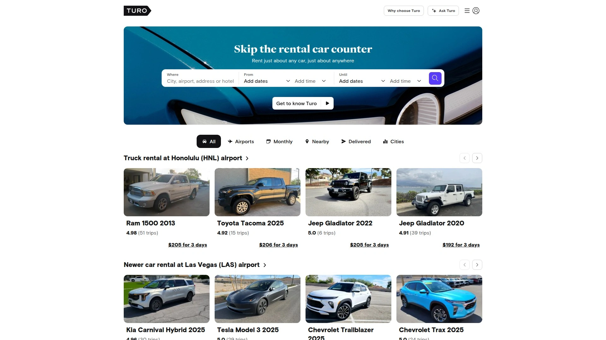

Turo operates as the Airbnb of car rentals, connecting owners with renters. Vehicle selection spans everyday sedans to exotic sports cars unavailable at traditional agencies. Daily rental rates often beat conventional rental companies, especially for longer bookings. Owners set their own pricing and availability creating competitive markets. Insurance packages protect both owners and renters with options from basic to premium coverage. Airport pickup arrangements compete directly with rental counters at lower prices. The platform operates across the United States and internationally in select markets. Instant booking properties confirm immediately while others require owner approval. Guest reviews and ratings help assess owner reliability before committing. Commercial hosts operate multiple vehicles alongside individual occasional renters. Delivery and pickup services available in many markets for convenience. Turo takes a percentage of rental fees, with owner earnings varying by selected insurance protection level. The platform suits travelers wanting specific vehicle types or avoiding airport rental hassles. Young driver fees typically lower than traditional agencies expanding access. Turo's variety enables unique experiences like renting luxury cars for special occasions without long-term commitments.

---

## **[Dosh](https://www.dosh.com)**

Automatic cashback app that ceased operations February 2025 after years serving users.

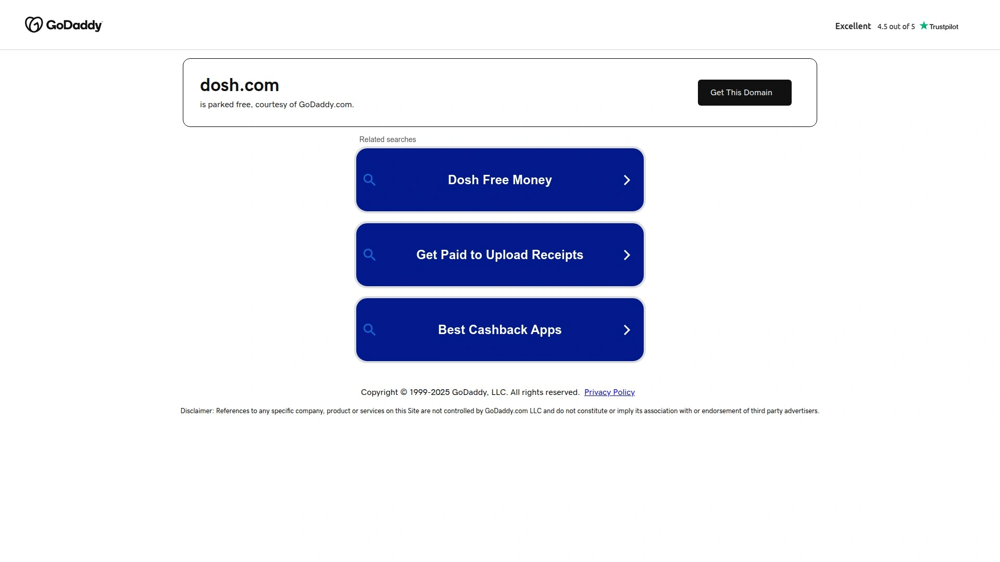

Dosh provided automatic cashback by linking credit and debit cards to track spending at 1,000+ merchants. The hands-off approach eliminated receipt scanning and offer activation requirements. Users earned 3-10% cashback at participating retailers, restaurants, and hotels automatically. Bank-level encryption protected card information without storing data on servers. Hotel booking through the app generated cashback on accommodations. PayPal and Venmo cash outs required minimum $15 balances. The service operated successfully for several years, with some users earning over $2,000 before closure. App Store ratings reached 4.7 stars with Google Play showing 4.5, reflecting user satisfaction during operation. The February 28, 2025 shutdown ended services permanently with users unable to access the platform. Existing balances handled according to terms of service during wind-down procedures. Dosh's closure demonstrates volatility in the cashback app market despite strong user bases. Some debit cards used Dosh backend technology for their own cashback offerings. The platform served users wanting passive earning without active participation. Former Dosh users now seek alternatives providing similar automatic card-linked cashback functionality.

***

## **[Checkout 51](https://www.checkout51.com)**

Grocery-focused cashback app offering weekly changing offers on common household items.

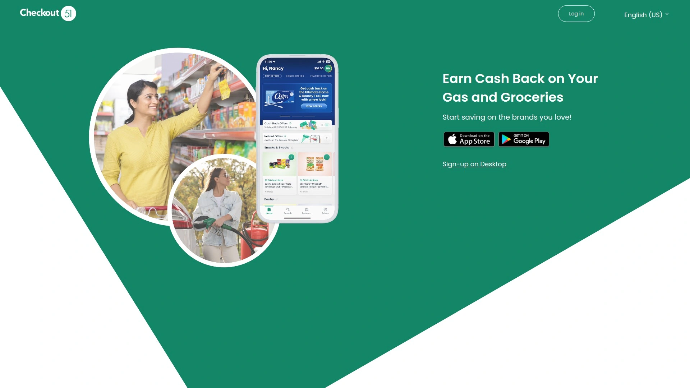

Checkout 51 publishes new offers every Thursday featuring grocery items and household products. You select desired offers before shopping, then purchase featured items anywhere. Upload receipts showing purchased items to receive cashback within 24 hours. Offers include national brands and any-brand categories like milk or eggs. Cash out via check, PayPal, or gift cards once reaching $20 minimum. The platform works at any grocery store, eliminating store-specific restrictions. Bonus offers provide extra earnings for purchasing multiple featured items. The straightforward process appeals to users wanting simplicity over complex reward systems. Offer selection changes weekly, requiring regular app checks to maximize earnings. Some offers have quantity limits or household restrictions preventing stockpiling. Cashback amounts typically range from $0.25 to $3 per item depending on product category. The app combines easily with store loyalty programs and manufacturer coupons for stacked savings. Receipt uploads require clear photos showing purchase details for verification. Rejection happens when receipts lack required information or items don't match offer terms. Checkout 51 suits regular grocery shoppers buying common household items covered by weekly offers. The platform emphasizes grocery staples over restaurant dining or non-food shopping categories.

***

## **[BeFrugal](https://www.befrugal.com)**

Cashback portal featuring automatic price comparison and coupon application across retailers.

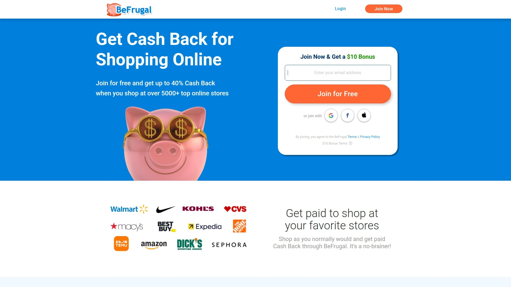

BeFrugal provides cashback rates at thousands of online retailers combined with automatic coupon finding. The browser extension activates when shopping, applying best available codes at checkout. Price comparison tools show where to find products cheaper across competing retailers. Cashback rates often match or exceed competitor portals for equivalent retailers. Cash out options include PayPal, Amazon gift cards, or charity donations once reaching $25 minimum. Double cashback promotions regularly feature selected retailers with limited-time increased rates. The platform guarantees accurate cashback tracking and honors shopping trips qualifying for rewards. Missing cashback claim process handles situations where tracking fails. Email alerts notify you of increased cashback rates at saved favorite stores. The service remains completely free, generating revenue through merchant partnerships. Browser extension works across Chrome, Firefox, Safari, and Edge covering most users. Mobile shopping covered through partner apps and mobile browser extension support. Holiday bonus programs offer extra cashback during peak shopping seasons. BeFrugal suits users preferring browser-based shopping tools over mobile app dependence. The platform's longevity since 2009 demonstrates sustained viability in competitive cashback markets.

***

## FAQ

**How do I maximize cashback earnings across multiple apps?**

Stack rewards by using cashback apps like Super.com or Rakuten for purchases while paying with cashback credit cards. Check multiple platforms before shopping since cashback rates vary by retailer and change frequently. Focus on apps matching your natural spending patterns rather than forcing purchases just for rewards, and track which apps offer best rates for your regular shopping destinations.

**Why do some cashback apps require minimum withdrawal amounts?**

Minimum thresholds like the $15-$25 required by most platforms reduce transaction processing costs for small payouts. This keeps the apps free to use by limiting administrative expenses from frequent tiny withdrawals. The minimums encourage continued app usage while you accumulate qualifying balances, benefiting both users who build larger rewards and platforms managing payout logistics.

**What happens to rewards when switching between hotel booking platforms?**

Each platform maintains separate accounts and reward systems that don't transfer between competitors. Compare total costs including rewards rather than just sticker prices, since [Super.com](https://www.super.com) might offer 10% cashback offsetting slightly higher base rates versus competitors. Focus on 2-3 primary platforms to concentrate loyalty benefits instead of spreading bookings too thin across many services.

***

## Conclusion

The right combination of cashback and rewards apps turns everyday spending into tangible savings without complicated tracking systems or behavior changes. [Super.com](https://www.super.com) leads this lineup for users seeking comprehensive financial tools combining hotel deals, earning opportunities, and cashback features in one platform, eliminating the need to juggle separate services. Whether booking travel, buying groceries, or filling up gas, matching apps to your natural spending patterns delivers real money back in your pocket rather than chasing marginal rewards across too many platforms.
